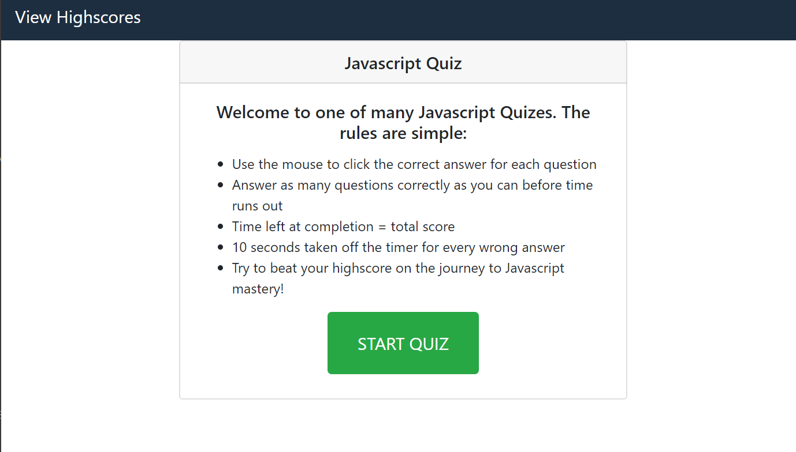
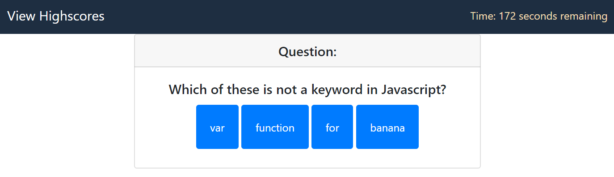
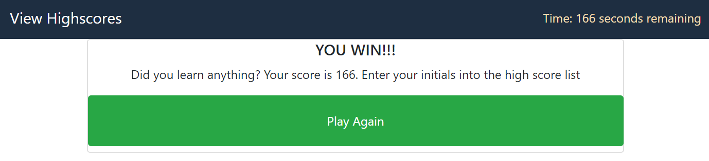
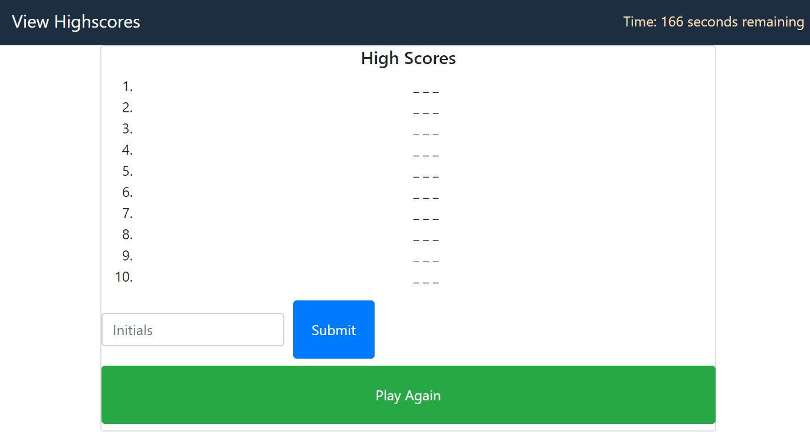

# Javascript Quiz App

## Where to Play

https://fmiusov.github.io/javascriptQuiz/

## How to Play

- Use the mouse to click the correct answer for each question
- Answer as many questions correctly as you can before time runs out
- Time left at completion = total score
- 10 seconds taken off the timer for every wrong answer
- Try to beat your highscore on the journey to Javascript mastery!

## Lessons Learned

- Always pseudocode first (no pseduocoding was done on this project, and it spiraled out of control in terms of cohesiveness and logic)
- Do not declare global variables (pay attention to scope)
- Know when to use hide/collapse and when to add a new html page
- The larger the project, the more time that needs to be set aside for debugging
- Slow and steady console.logging will pay off in dividends
- Time management continues to be a tricky skill to master in these projects. It is not enough to brute force the code, I need to approach it in a more efficient way (pseudocoding, console.logging)

## To-Do List

- Nearing the due date for this project, I became aware of several ways to improve the code, but did not have time to implement them
- For this reason, I have left a To-Do list and various notes-to-self in the javascript so that I can revisit this in the future

## Gallery

